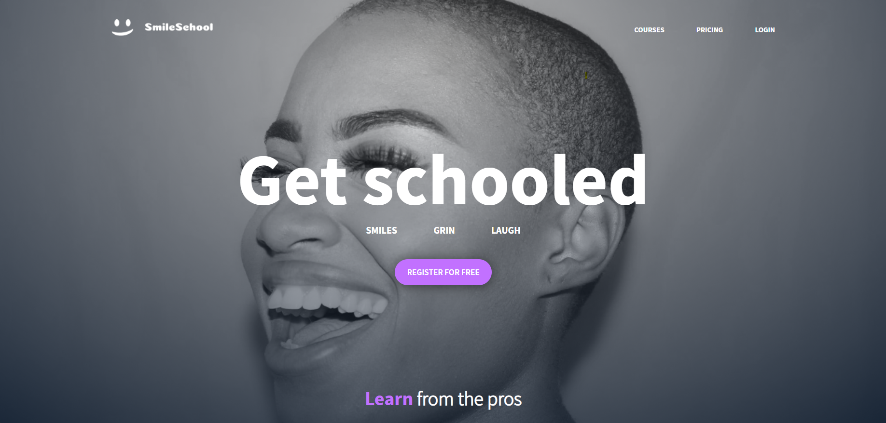
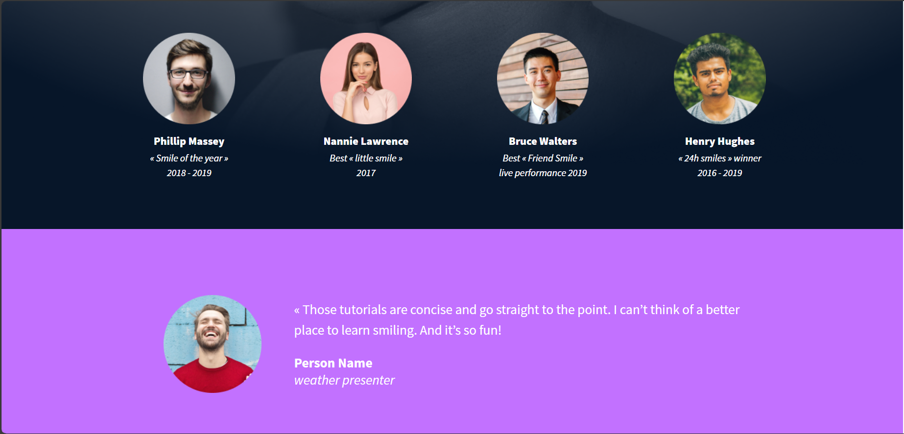
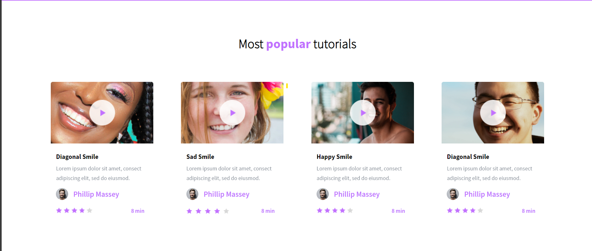
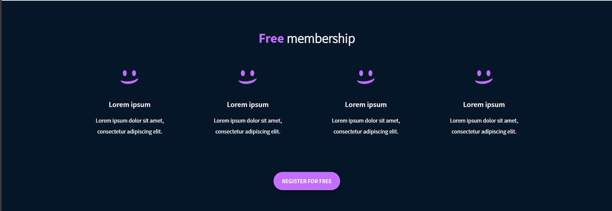
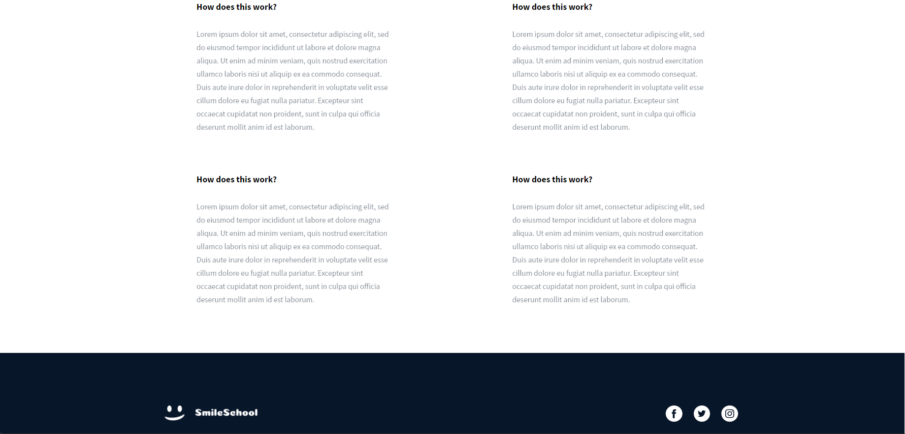

# ADVANCE CSS

## Learning Objectives

At the end of this project, you are expected to be able to explain to anyone, without the help of Google:

- What is CSS
- How to add style to an element
- What is a class
- What is a selector
- How to compute CSS Specificity Value
- What are Box properties in CSS
- How does the browser load a webpage

## Concepts

For this project, we expect you to look at these concepts:

- Some pointers about CSS
- CSS fundamentals
- CSS advanced

The main goal of this project is to design a website based on figma design

